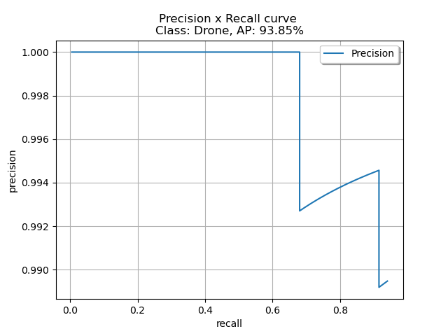
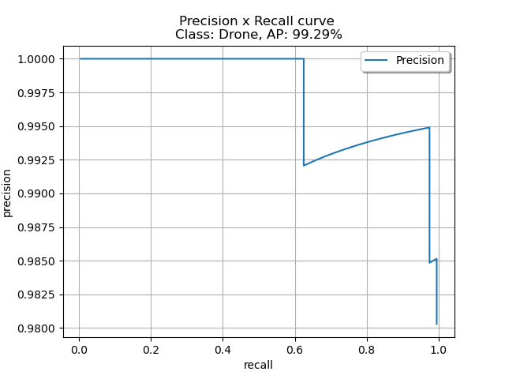
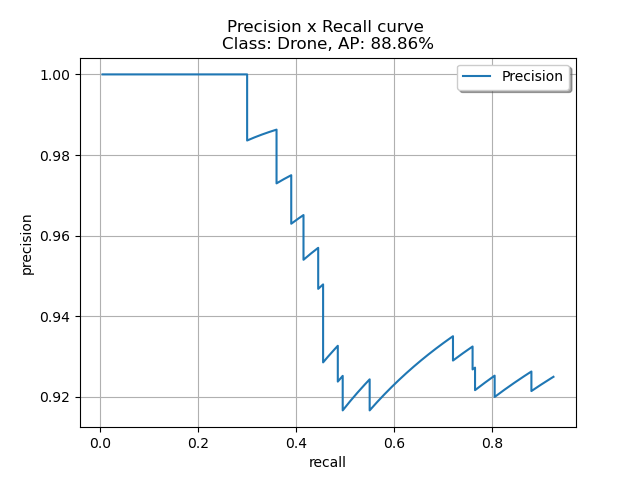
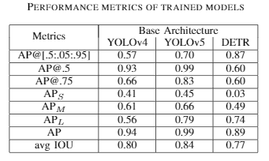

# D-Drone_v2
Detection of Drones using Computer Vision Algorithms

## Citation
This work was published in the [2021 International Conference on Electrical, Communication, and Computer Engineering (ICECCE)](https://ieeexplore.ieee.org/document/9514124)

If you use this dataset or models in your research, please consider citing this:
```
@inproceedings{kabir2021deep,
  title={Deep Learning Inspired Vision based Frameworks for Drone Detection},
  author={Kabir, Muhammad Salman and Ndukwe, Ikechi Kalu and Awan, Engr Zainab Shahid},
  booktitle={2021 International Conference on Electrical, Communication, and Computer Engineering (ICECCE)},
  pages={1--5},
  year={2021},
  organization={IEEE}
}
```

## YOLOv4 based Model
For authors' work, please check [this](https://drive.google.com/drive/folders/1SGgtK0FJicg-0E2usUne9w4FQ4Gre2j9?usp=sharing)

Dataset: [https://drive.google.com/drive/folders/1_hZ1s7CSGq0-4ntKfrI08nLO9ncmKh7c?usp=sharing]

Weights: [https://drive.google.com/file/d/11O-HNd1pNvrN8P5nKCfPUb3jc0XNsj1u/view?usp=sharing]

Configuration File: [https://drive.google.com/file/d/1LIDTcTqRIoH7E-2nmEM8ZvD-PZODnXb_/view?usp=sharing]



## YOLOv5 based Model
For authors' work, please check [this](https://drive.google.com/drive/folders/14Tfz8pdNqrTzAwVxs0HB1jbRtyVD1Tw5?usp=sharing)

Datasets: [https://drive.google.com/drive/folders/1_hZ1s7CSGq0-4ntKfrI08nLO9ncmKh7c?usp=sharing]

Weights: [https://drive.google.com/file/d/11so8ybkIqLFqvSkww2KEHJgtAWszC2Gv/view?usp=sharing]


 
## DETR based Model
For authors' work, please check [this](https://drive.google.com/drive/folders/1SGgtK0FJicg-0E2usUne9w4FQ4Gre2j9?usp=sharing)

Datasets: [https://drive.google.com/drive/folders/1_hZ1s7CSGq0-4ntKfrI08nLO9ncmKh7c?usp=sharing]

Weights: [https://drive.google.com/file/d/1--MtwzFFU1nrI_9TX8sY_f7ZHSHO_suy/view?usp=sharing]



## Results
For assesment of trained models, an [open source tool](https://github.com/rafaelpadilla/review_object_detection_metrics) is used.



